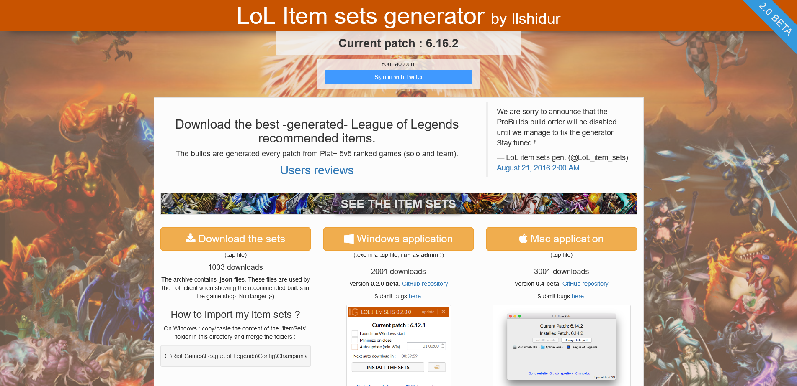

# [LoL item sets generator](https://lol-item-sets-generator.org)

> Download the best -generated- League of Legends recommended items.<br/>
**This project is currently being rewritten from scratch**. You can see the actual website in working progress in the [_version-3_ branch](https://github.com/league-of-legends-devs/lol-item-sets-generator.org/tree/version-3).

[](https://slack.lol-item-sets-generator.org/)
[](https://twitter.com/Unreal_IRCd)



## Reporting a bug

* Bug on the **website** : [submit here](https://github.com/league-of-legends-devs/lol-item-sets-generator.org/issues/new)
* Bug on the **item sets** : [submit here](https://github.com/league-of-legends-devs/feeder.lol-item-sets-generator.org/issues/new)
* Bug on the **application** :
  * Windows : [submit here](https://github.com/league-of-legends-devs/LoL-item-sets/issues/new)
  * Mac : [submit here](https://github.com/league-of-legends-devs/LoL-item-sets-Mac/issues/new)

## Build

Required :
* Docker

Steps :
```shell
git clone https://github.com/league-of-legends-devs/lol-item-sets-generator.org.git
docker build --rm -t lol-item-sets-generator.org:latest .
docker run # TODO
# NODE_ENV
# MONGO_URL
# ITEM_SETS_ZIP_LOCATION
# ROOT_URL
# ADMIN_MAIL
# KADIRA_APP_ID
# KADIRA_APP_SECRET
# PORT
```

## Backers

* Jérôme P.

Thank you for donating !

## License

Copyright (c) 2015-2017 **Nicolas COUTIN**

Permission is hereby granted, free of charge, to any person obtaining a copy
of this software and associated documentation files (the "Software"), to deal
in the Software without restriction, including without limitation the rights
to use, copy, modify, merge, publish, distribute, sublicense, and/or sell
copies of the Software, and to permit persons to whom the Software is
furnished to do so, subject to the following conditions:

The above copyright notice and this permission notice shall be included in all
copies or substantial portions of the Software.

THE SOFTWARE IS PROVIDED "AS IS", WITHOUT WARRANTY OF ANY KIND, EXPRESS OR
IMPLIED, INCLUDING BUT NOT LIMITED TO THE WARRANTIES OF MERCHANTABILITY,
FITNESS FOR A PARTICULAR PURPOSE AND NONINFRINGEMENT. IN NO EVENT SHALL THE
AUTHORS OR COPYRIGHT HOLDERS BE LIABLE FOR ANY CLAIM, DAMAGES OR OTHER
LIABILITY, WHETHER IN AN ACTION OF CONTRACT, TORT OR OTHERWISE, ARISING FROM,
OUT OF OR IN CONNECTION WITH THE SOFTWARE OR THE USE OR OTHER DEALINGS IN THE
SOFTWARE.

**"LoL item sets generator" isn't endorsed by Riot Games and doesn't reflect the views or opinions of Riot Games or anyone officially involved in producing or managing League of Legends.
League of Legends and Riot Games are trademarks or registered trademarks of Riot Games, Inc. League of Legends © Riot Games, Inc.**

## Contact

Contact me at [ilshidur@lol-item-sets-generator.org](mailto:ilshidur@lol-item-sets-generator.org) or [ilshidur@gmail.com](mailto:ilshidur@gmail.com).
